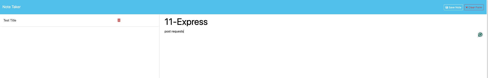

# note-taker

## Description

    1. Opening Note Taker web application brings you to landing page that has a link to the notes page
    2. Notes page presents exisiting notes and a field to create new notes
    3. Creating a new note with a title allows you to save or clear the fields
    4. Saving a note clears the note field, hides the clear and save buttons, then moves it to the saved notes column
    5. Clicking on an existing note opens it in the note field and a button to create a new note appears
    6. Clicking New Note clears the field to enter a new title and text 

## Final Product

### Landing Page

### Notes Page 

## New Note

### Save Note

### Opened Saved Note

## [ Note Taker ](https://thawing-bastion-91499-d652284a8c77.herokuapp.com/)